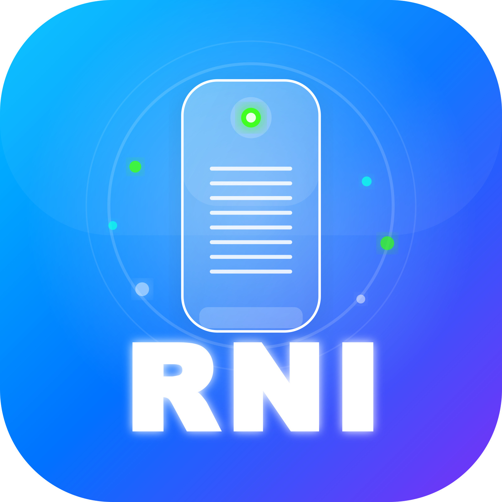

# Rni Air Purifier

Flutter application for controlling and monitoring air purification devices via Bluetooth Low Energy (BLE). Scan for nearby BLE devices, connect to your Rni Air Purifier, and monitor real-time air quality metrics.

<p align="center">
    
</p>


## Features

### Bluetooth Connectivity

- Scan for nearby BLE devices
- Connect to RNI Air Purifier devices
- Automatic bonding on Android
- Real-time connection status monitoring
- Graceful disconnection handling

### Real-Time Monitoring

- Live Dust readings chart
- Humidity and Temperature readings
- Device status updates

### Device Control

- Fan mode switching (Manual, Auto)

### Smart Features

- Device settings configuration
- User-friendly dialogs and notifications
- Error handling and recovery
- Permission management

---

## Supported Platforms

| Platform   | Status               | Minimum Version  |
|------------|----------------------|------------------|
| **Android**| Supported            | Android 6.0+     |
| **iOS**    | Not tested           | iOS 11.0+        |
| **macOS**  | Not tested           | macOS 10.14+     |
| **Web**    | Bluetooth Limited    | N/A              |

---

## Getting Started

### Prerequisites

- Flutter SDK 3.41.2 or higher
- Dart SDK 3.11.0 or higher
- Android SDK 21+ (for Android)
- Xcode 14.0+ (for iOS)
- Rni Air Purifier device

### Installation

#### 1. Clone the Repository

```bash
git clone https://github.com/cpe37-xiao/rni_air_purifier.git
```

#### 2. Install Dependencies

```bash
flutter pub get
```

#### 3. Run the App

```bash
# On a connected device
flutter run

# Or specify device
flutter run -d <device_id>

# For release build
flutter run --release
```

---

## Project Structure

```tree
lib/
├── main.dart      # App entry point
│
│
├── features/
│   ├── bluetooth/ # Bluetooth Low Energy Specifics
│   ├── main/      # Main App's design and structure
|   |   └── dialog/    # Error popups
│   └── Themes/
|
└── pubspec.yaml   # Project dependencies
```

---

## Dependencies

### Core

- **flutter**: Flutter SDK
- **provider**: ^6.1.5+1 - State management
- **flutter_blue_plus**: ^2.1.1 - Bluetooth Low Energy

### UI & UX

- **gap**: ^3.0.1 - Spacing utilities
- **fl_chart**: ^1.1.1 - Charting library
- **flutter_animate**: ^4.5.2 - Visualization/ UI design

### Utilities

- **permission_handler**: ^12.0.1 - Permission management for IOS/Andriod/MAC

See `pubspec.yaml` for complete dependencies.

---

## Usage

### Basic Workflow

#### 1. Scan for Devices

- In DashboardPage, navigate to BluetoothScannerPage
- Tap "Start Scan" on the bottom right to begin searching

#### 2. Connect to Device

- Select "ESP_BT" device from the list
- App will automatically handle bonding (Android)
- Connection status shows in AppBar (Top right indicators, you can click on them for more info)

#### 3. Monitor Air Quality

- View real-time Dust readings
- View Humidity and Temperature
- Check device status

#### 4. Control Device

- Switch operation modes (Manual on, Manual off, Auto)
- Modify auto mode threshold

## Troubleshooting

### No Devices Found

1. Verify device is powered on
2. Check device is advertising
3. Ensure location permission is granted
4. Make sure the device is supported with the app
5. Use BLE Scanner app to verify device is visible

### Connection Fails

1. Check Bluetooth permissions
2. Verify device is not already connected
3. Try restarting the device
4. Restart both phone and device
5. Check Android version (6.0+)

### Permission Denied

1. Go to Settings → Apps → RNI Air Purifier → Permissions
2. Enable Bluetooth and Location permissions
3. Restart the app

### Poor Signal

1. Move closer to device (< 10 meters)
2. Remove obstacles between phone and device
3. Check for interference from other Bluetooth devices
4. Try connecting in a different location

---

## Permissions

The app requires the following permissions:

|             Permission                |       Purpose        |  Platform   |
|---------------------------------------|----------------------|-------------|
| **BLUETOOTH_SCAN**                    | Scan for BLE devices | Android 12+ |
| **BLUETOOTH_CONNECT**                 | Connect to devices   | Android 12+ |
| **ACCESS_FINE_LOCATION**              | BLE scanning         | Android 6+  |
| **NSBluetoothAlwaysUsageDescription** | Bluetooth usage      | iOS         |

---

## Building for Production

### Android

```bash
# Generate signed APK
flutter build apk --release

# Or AAB for Play Store
flutter build appbundle --release
```

### iOS

```bash
# Build for iOS
flutter build ios --release

# Archive for TestFlight
cd ios
xcodebuild -workspace Runner.xcworkspace \
  -scheme Runner \
  -configuration Release \
  -archivePath build/Runner.xcarchive archive
cd ..
```

### MacOS

```bash
flutter build macos --release
```

## License

This project is licensed under the MIT License - see the [LICENSE](LICENSE) file for details.

---

## Authors

- **Parkorn Tuntiwattanakhul** - [GitHub](https://github.com/parkornT)

---

[back to top](#rni-air-purifier)

</div>
